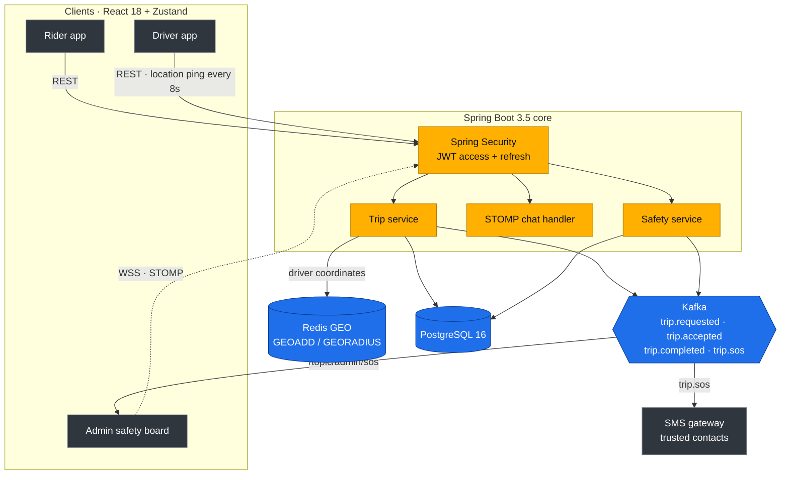
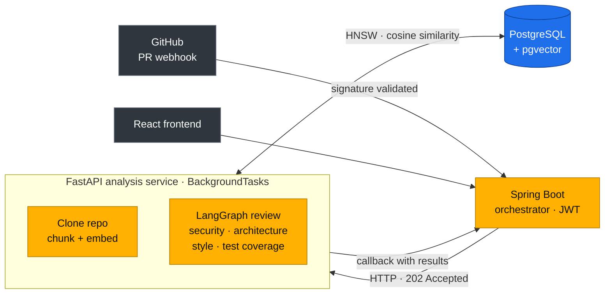
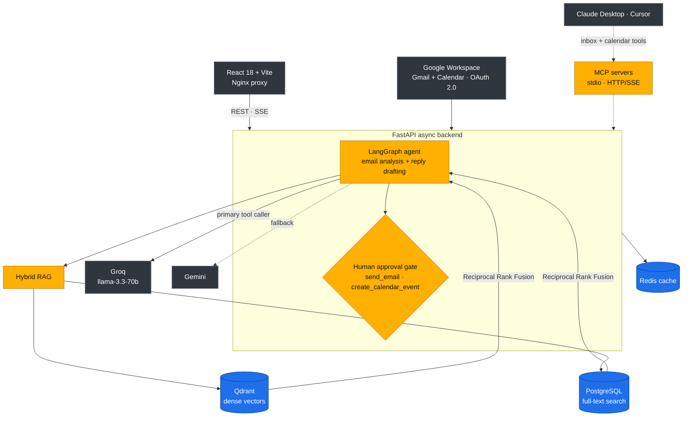
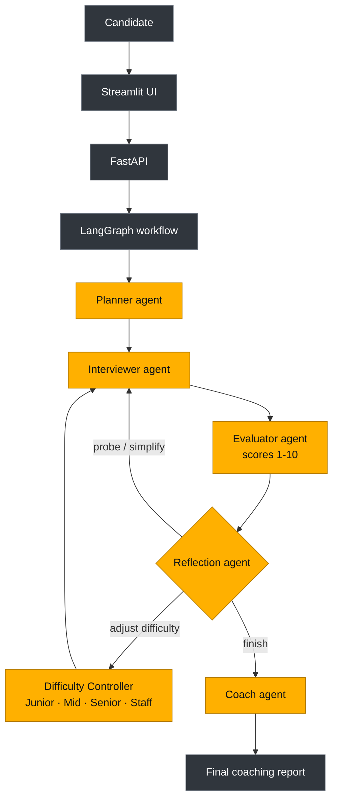

  

  

<i>B.Tech CSE (Artificial Intelligence) · GL Bajaj Institute of Technology and Management · 2023 – 2027 
Open to AI/LLM Engineering and Software Engineering roles.</i>

 

## 👋 About

I build **agentic AI systems** and the **distributed backends** they run on. My projects pair a Java/Spring Boot core with Python/FastAPI AI services, and I ship them with Kubernetes and CI/CD.

- 🤖 **AI:** LangGraph StateGraphs, hybrid RAG (Qdrant + pgvector), MCP servers, human-in-the-loop agents
- ⚙️ **Backend:** event-driven services with Kafka, Redis GEO, STOMP WebSockets, JWT security
- ☸️ **Infra:** 5-service Kubernetes cluster, GitHub Actions CI/CD publishing to GHCR
- 💬 **Ask me about:** LangGraph, Kafka event streams, RAG pipelines, Spring Boot / FastAPI architecture

 

## 🚀 Featured projects

### 🚗 HerRide: women-only ride-hailing platform
     

A safety-first ride-hailing MVP for India that connects verified female drivers with passengers. It has real-time driver matching, trusted-contact SOS escalation and an admin safety dispatch board.

- **Kafka decoupling:** ride requests, driver matches, completions and SOS alarms are published as events, so notifications and audits never block the API threads.
- **Redis GEO:** drivers ping every 8 seconds, and `GEORADIUS` returns riders their nearby drivers within 5 km without SQL geometric scans.
- **SOS pipeline:** `trip.sos` triggers an SMS with a live location link to trusted contacts and a STOMP broadcast to the admin dispatch board.
- **Security:** a female-only signup rule enforced in the API, plus JWT with refresh-token rotation. Docs via Swagger, metrics via Prometheus/Grafana.

[**Code**](https://github.com/ansh62949/Herride) · [**Live demo**](https://herride-six.vercel.app) · [**Swagger**](https://herride.onrender.com/swagger-ui.html)

 

### 🤖 PRSense AI: repository-aware PR review
     

When a pull request opens, PRSense reviews the diff against the repository's own indexed code and flags issues in security, architecture, style and test coverage.

- **Two independently deployable services:** Spring Boot handles auth, webhooks and persistence, and FastAPI handles indexing and LLM analysis.
- **Grounded reviews:** repository code is chunked and embedded into pgvector (1536-dimension vectors), and each review retrieves the nearest context for the diff.
- **Deliberate trade-off:** direct HTTP with async callbacks instead of a message queue, to keep deployment simple for small and mid-sized workloads.

[**Code**](https://github.com/ansh62949/prsense-ai) · [**Live demo**](https://prsense-ai.vercel.app/)

 

### 📬 FlowInbox AI: agentic email workspace
    

 

An AI-native workspace where LangGraph agents triage Gmail threads, analyze intent, sender context, sentiment and urgency, and draft grounded replies. Consequential actions wait for human approval.

- **Hybrid retrieval:** dense vectors from Qdrant and PostgreSQL full-text results are merged with Reciprocal Rank Fusion.
- **Safe by design:** sending an email or creating a calendar event creates a pending approval request, and nothing is dispatched without human sign-off.
- **MCP:** inbox and calendar tools are exposed to Claude Desktop and Cursor over stdio and HTTP/SSE.
- **Shipped like a product:** a 5-service Kubernetes manifest set (backend, frontend, PostgreSQL, Qdrant, Redis) with health probes, persistent volumes and a documented self-healing demo. GitHub Actions runs 16 Pytest cases and publishes images to GHCR.

[**Code**](https://github.com/ansh62949/FlowInbox) · [**Live demo**](https://flow-inbox.vercel.app)

 

### 🎯 AI Mock Interview Coach: adaptive multi-agent interviewer
    

An interview platform that adapts to the candidate instead of following a fixed question list. A Reflection agent decides each turn whether to probe, simplify, change difficulty or finish.

- **Why a graph:** interviews are non-linear, and conditional routing edges model probing, difficulty changes and topic transitions better than a fixed chain.
- **Separation of concerns:** the Evaluator scores objectively and the Reflection agent decides routing, which keeps rules like the follow-up cap (`probe_count <= 2`) deterministic.
- **Typed contracts:** Pydantic V2 schemas (`InterviewStrategy`, `EvaluationResult`, `ReflectionOutput`, `FinalReport`) sit over a shared `InterviewState`. 13/13 Pytest cases cover agents, schemas, graph and API.

[**Code**](https://github.com/ansh62949/AI-Mock-Interview-Coach)

 

## 🛠️ Tech stack

| | |
|:--|:--|
| **🤖 Agents & Orchestration** |      |
| **🔎 RAG & Retrieval** |      |
| **🧠 LLMs & Prompting** |      |
| **⚡ AI Services (Python)** |     |
| **⚙️ Backend (Java)** |     |
| **🔀 Distributed Systems** |    |
| **🗄️ Databases** |  |
| **☸️ Deployment** |   |

 

## 🏆 Achievements & certifications

- 🌍 **Hack the Globe 2026 (GlobalSpark):** selected for Round 2 out of thousands of global applicants
- 🧩 **LeetCode:** 300+ problems across Arrays, Trees, Graphs, DP and Greedy
- 🤗 **Hugging Face:** Agents Course, Certificate of Excellence (Sep 2026)
- 💻 **Claude Academy:** Claude Code in Action (Sep 2026)
- 🏢 **Walmart Global Tech & Hewlett Packard Enterprise:** SWE Virtual Experience Programs, Forage (Feb 2025)

 

## 📊 GitHub stats

  
  

  

 

<i>Building resilient backends and intelligent agentic workflows.</i>

